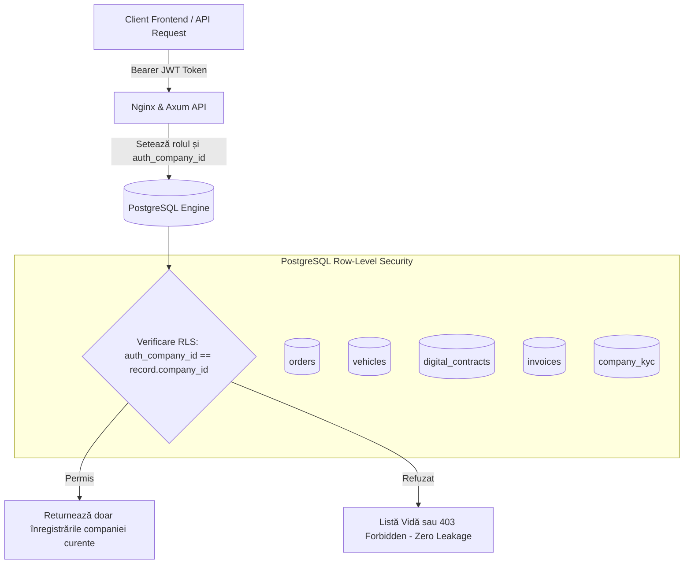

# OptiFleet B2B — Arhitectura de Securitate, Conformitate Legală și Protecția Datelor cu Caracter Personal

> **Proiect de Licență**: Sistem Inteligent B2B de Grupare și Optimizare a Rutelor Logistice din Republica Moldova  
> **Instituție**: Universitatea Tehnică a Moldovei (UTM) — Facultatea Calculatoare, Informatică și Microelectronică (FCIM)  
> **Cadrul de Reglementare**: Legea RM nr. 133/2011, GDPR (Regulamentul UE 2016/679), Codul Transporturilor Rutiere nr. 150/2014, Codul Civil al RM nr. 1107/2002  

---

## 1. Sinteză Executivă și Nivelul de Securitate

În conformitate cu cerințele din **Ghidul Master UTM** (Etapele 1, 7 și 13), securitatea și protecția datelor reprezintă piloni **blocanți** ai platformei OptiFleet. Într-un sistem logistic B2B în care concurenți direcți din sectorul IMM (distribuitori, producători, transportatori) împart capacități de transport, izolarea strictă a datelor comerciale și protecția datelor cu caracter personal ale șoferilor și administratorilor sunt garanții esențiale pentru viabilitatea pe piață.

Platforma implementează modelul arhitectural **Defense-in-Depth (Securitate în Adâncime)**, acoperind 5 niveluri independente de protecție:
1. **Nivelul Bazei de Date**: PostgreSQL Row-Level Security (RLS) nativ la nivel de rând (Zero Trust Multi-Tenancy).
2. **Nivelul API Backend**: Autentificare bazată pe token-uri criptografice JWT (RS256/HS256), validare de roluri RBAC și filtrare a parametrilor de intrare.
3. **Nivelul Criptografic**: Amprentare documentară SHA-256 pentru contracte B2B, asigurând imutabilitatea și non-repudierea.
4. **Nivelul Juridic și KYC**: Validare automată a codului IDNO (13 cifre) prin algoritmul ASP Modulo 11, verificare a licențelor ANTA și polițelor CMR.
5. **Nivelul de Audit**: Jurnalizare imutabilă (append-only) a evenimentelor de securitate, a tentativelor de acces neautorizat și a modificărilor de stare critică.

---

## 2. Cadrul Legal al Republicii Moldova și Protecția Datelor Personale

### 2.1. Legea Republicii Moldova nr. 133 din 08.07.2011 privind protecția datelor cu caracter personal

Platforma OptiFleet prelucrează date cu caracter personal în conformitate cu dispozițiile **Legii nr. 133/2011**, sub supravegherea Centrului Național pentru Protecția Datelor cu Caracter Personal (CNPDCP):

| Principiu Legal (Legea 133/2011) | Implementare Tehnică în OptiFleet B2B |
| :--- | :--- |
| **Principiul Legalității și Echității (Art. 4 alin. 1 lit. a)** | Prelucrarea datelor se face exclusiv în baza executării contractului de transport comercial B2B și a consimțământului explicit exprimat la înregistrare. |
| **Principiul Limitării Scopului (Art. 4 alin. 1 lit. b)** | Datele de identificare (nume administrator, IDNP, telefon) sunt utilizate strict pentru verificarea KYC, facturare și emiterea scrisorilor de trăsură CMR. |
| **Principiul Minimizării Datelor (Art. 4 alin. 1 lit. c)** | Nu se colectează date personale nenecesare. Datele de geolocalizare ale șoferului sunt prelucrate doar în intervalul activ al cursei (status `ON_ROUTE`). |
| **Principiul Exactității Datelor (Art. 4 alin. 1 lit. d)** | Validarea matematică a IDNO-ului previne erorile umane și înregistrarea de entități inexistente. |
| **Principiul Păstrării Limitate (Art. 4 alin. 1 lit. e)** | Jurnalele de urmărire GPS fină sunt agregate la nivel de kilometri și durată după finalizarea și decontarea cursei. |
| **Principiul Securității și Confidențialității (Art. 29-30)** | Criptarea în tranzit (TLS 1.3 / HTTPS), hash-uri de parolă cu Argon2 / Bcrypt, restricționarea accesului prin Row-Level Security. |

### 2.2. Drepturile Subiecților Datelor și Mecanismele Tehnice Asigurate
- **Dreptul de acces (Art. 13)**: Fiecare utilizator își poate descărca profilul, datele companiei și istoricul comenzilor prin API (`/me`, `/companies/verify`).
- **Dreptul de rectificare (Art. 14)**: Posibilitatea actualizării documentelor expirate și a numerelor de contact din profilul de transportator/comerciant.
- **Dreptul de ștergere / Dreptul de a fi uitat (Art. 15)**: Anonimizarea conturilor utilizatorilor la cerere, păstrând doar jurnalele financiare cerute obligatoriu de legislația fiscală a RM (Codul Fiscal — 5 ani).
- **Datele de Localizare Geografică (GPS)**: Conform Ghidului CNPDCP, șoferul este informat despre activarea monitorizării GPS pe vehicul, iar tracking-ul se dezactivează automat la trecerea vehiculului în starea `AVAILABLE` sau `OFFLINE`.

### 2.3. Relația cu GDPR (Regulamentul General UE 2016/679)
Deși este focalizată pe piața Republicii Moldova, arhitectura OptiFleet asigură conformitate deplină cu standardele GDPR pentru facilitarea interoperabilității cu parteneri comerciali din Uniunea Europeană (de ex. România, rutele Chișinău – Iași / București):
- Standarde "Privacy by Design" și "Privacy by Default".
- Acorduri de prelucrare a datelor (DPA) integrate în Termenii și Condițiile B2B.
- Criptare end-to-end pe transport și segmentare a rolurilor.

### 2.4. Codul Transporturilor Rutiere al RM nr. 150/2014 & Licențierea ANTA
Conform Codului Transporturilor Rutiere, transportul rutier de mărfuri contra cost pe teritoriul Republicii Moldova este permis doar operatorilor de transport înregistrați în Registrul Operatorilor de Transport Rutier (ROTR) gestionat de **ANTA (Agenția Națională Transport Auto)**.
- OptiFleet impune validarea copiei conforme a licenței de transport ANTA și a poliței de asigurare de răspundere a cărăușului (**CMR**) înainte ca un transportator să poată licita sau prelua curse grupate.
- Un transportator cu documente respinse sau expirate este exclus automat din algoritmul de alocare a curselor.

### 2.5. Delimitare Juridică: Acceptare Digitală vs. Semnătură Electronică Calificată (MSign)
Conform **Legii nr. 124/2022 privind identificarea electronică și serviciile de încredere**, în memoriul de licență se menționează transparent următoarea delimitare funcțională:
- **Implementarea actuală OptiFleet**: Reprezintă o **acceptare digitală fermă cu amprentă criptografică SHA-256**, asociată cu timestamp de server, identificator de sesiune autentificată (JWT) și adresă IP conform Art. 1014-1017 din Codul Civil al RM (încheierea contractelor la distanță prin mijloace electronice).
- **Extensie de producție recomandată**: Integrarea modulului guvernamental **MSign / PKI** (serviciul național de semnătură electronică calificată din Republica Moldova) ca un strat opțional adițional la validarea contractelor de valoare mare.

---

## 3. Algoritmul Matematic de Validare a IDNO (Agenția Servicii Publice - ASP)

În Republica Moldova, orice entitate juridică (SRL, Î.I., SA) și persoană fizică deține un Număr de Identificare de Stat (IDNO/IDNP) format din **13 cifre zecimale**.

### 3.1. Algoritmul de Verificare Modulo 11
Pentru a preveni falsificarea și introducerea de date eronate, cifra a 13-a ($C_{13}$) este o cifră de control calculată matematic pe baza primelor 12 cifre:

$$\text{Ponderi} = [7, 3, 1, 7, 3, 1, 7, 3, 1, 7, 3, 1]$$

$$\text{Suma} = \sum_{i=1}^{12} (D_i \times W_i)$$

$$\text{Rest} = \text{Suma} \pmod{11}$$

- Dacă $\text{Rest} < 10$, atunci $C_{13} = \text{Rest}$.
- Dacă $\text{Rest} = 10$, atunci $C_{13} = 0$.

### 3.2. Implementarea în OptiFleet (`frontend/src/lib/idno-validator.ts`)
```typescript
export function validateMoldovaIdno(idno: string): { isValid: boolean; error?: string } {
  if (!/^\d{13}$/.test(idno)) {
    return { isValid: false, error: "IDNO-ul trebuie să conțină exact 13 cifre numerice." };
  }
  const digits = idno.split("").map(Number);
  const weights = [7, 3, 1, 7, 3, 1, 7, 3, 1, 7, 3, 1];
  let sum = 0;
  for (let i = 0; i < 12; i++) {
    sum += digits[i] * weights[i];
  }
  const remainder = sum % 11;
  const expectedCheckDigit = remainder === 10 ? 0 : remainder;
  if (digits[12] !== expectedCheckDigit) {
    return { isValid: false, error: `Cifra de control invalidă (așteptat: ${expectedCheckDigit}, primit: ${digits[12]}).` };
  }
  return { isValid: true };
}
```

### 3.3. Distincția Juridică între Formele de Organizare
1. **Societate cu Răspundere Limitată (SRL)**:
   - Răspunderea asociaților este limitată strict la valoarea aportului la capitalul social.
   - Documente obligatorii: Extras din Registrul de Stat al Persoanelor Juridice (ASP), Copie Certificat Înregistrare, Licență ANTA (pentru transportatori).
2. **Întreprindere Individuală (Î.I. / IP)**:
   - Persoana fizică titulară răspunde pentru obligațiile întreprinderii cu **întreg patrimoniul personal**.
   - Documente obligatorii: Buletin de identitate al administratorului/titularului + Decizia de înregistrare ASP.
3. **Societate pe Acțiuni (SA)**:
   - Cerințe de guvernanță corporativă avansată, extrase de la Comisia Națională a Pieței Financiare (CNPF) și ASP.

---

## 4. Matricea de Izolare Multi-Tenant (PostgreSQL Row-Level Security)

Conform **Etapei 1 din Ghidul Master UTM**, securitatea multi-tenant nu este lăsată la latitudinea codului backend, ci este forțată direct în nucleul bazei de date prin **Row-Level Security (RLS)**.



### 4.1. Matricea Rolurilor și a Privilegiilor (RBAC + RLS)

| Tabelă | Comerciant (SME / Merchant) | Transportator (Carrier) | Administrator Platformă (SUPER_ADMIN) |
| :--- | :--- | :--- | :--- |
| **`companies`** | SELECT doar propria companie | SELECT doar propria companie | ALL (vizualizare și editare completă) |
| **`orders`** | SELECT, INSERT, UPDATE pe comenzi proprii (cât timp nu sunt livrate) | SELECT doar pentru comenzile alocate pe cursele sale | ALL (vizibilitate globală pentru dispecerat) |
| **`vehicles`** | SELECT doar vehiculele care transportă comenzi proprii active | ALL pe propria flotă (INSERT, UPDATE, DELETE vehicule proprii) | ALL (supraveghere capacitate la nivel național) |
| **`group_buy_clusters`** | SELECT doar dacă are minim o comandă în cluster (`order_cluster_link`) | SELECT doar pentru clusterele ofertate sau alocate | ALL (creare, optimizare, anulare) |
| **`routes`** | SELECT traseul comenzilor sale (puncte de livrare și ETA) | ALL pe rutele asociate vehiculelor proprii | ALL (reconfigurare rute și puncte OSRM) |
| **`company_kyc`** | SELECT, INSERT dosar propriu de verificare | SELECT, INSERT dosar propriu (licențe ANTA) | ALL (Aprobare `VERIFIED`, Respingere `REJECTED`) |
| **`digital_contracts`** | SELECT contractele în care este beneficiar | SELECT și UPDATE (acceptare digitală) pe contractele alocate | ALL (audit, mediere dispute, anulare) |
| **`invoices`** | SELECT facturile emise către el | SELECT facturile pentru decontare plăți | ALL (încasare, confirmare plată, monitorizare restanțe) |
| **`audit_log`** | Fără acces direct | Fără acces direct | SELECT (analiză criminalistică și audit de securitate) |

---

## 5. Contracte Digitale B2B și Criptografie SHA-256

Pentru a asigura forță probantă și conformitate cu Art. 1014-1017 din Codul Civil al RM, fiecare cursă grupată optimizată generează un **Contract Digital de Transport Rutier**.

### 5.1. Protocolul de Amprentare Criptografică
1. La finalizarea algoritmului de rutare (OR-Tools CVRP) și selecția transportatorului, sistemul serializează termenii contractuali într-un payload JSON canonic (sortat alfabetic după chei, codificat UTF-8).
2. Se calculează rezumatul criptografic **SHA-256** (256 biți / 64 caractere hexazecimale) asupra conținutului documentului:

$$\text{Hash} = \text{SHA-256}(\text{Număr Contract} \parallel \text{IDNO Cărăuș} \parallel \text{IDNO Beneficiari} \parallel \text{Traseu OSRM} \parallel \text{Valoare MDL} \parallel \text{Timestamp})$$

3. Amprenta rezultată este stocată permanent în coloana `digital_contracts.sha256_hash`.
4. La acceptarea contractului, transportatorul execută operațiunea digitală de acceptare, iar sistemul consemnează:
   - `accepted_by_user`: Identificatorul unic al utilizatorului autentificat.
   - `accepted_at`: Timestamp certificat generat de serverul de baze de date (`NOW()`).
   - `accepted_ip`: Adresa IP a semnatarului (`INET`).
   - `terms_version`: Versiunea clauzelor standardizate aprobate (`v2.1-UTM-RM`).

### 5.2. Non-Repudiere și Verificare Tehnică
Dacă un cărăuș sau un beneficiar contestă clauzele contractuale, oricare dintre părți sau un arbitru/instanță poate re-genera hash-ul SHA-256 din conținutul documentului tipărit/PDF. Orice modificare chiar și a unui singur caracter (de exemplu modificarea prețului de la 1250 MDL la 2150 MDL) schimbă complet hash-ul rezultat (efectul de avalanșă SHA-256), dovedind tentativa de fraudă.

---

## 6. Registrul Financiar și Transparența Facturării

În conformitate cu cerința utilizatorului privind monitorizarea plăților și statisticile de încasări, platforma oferă în `/admin` un modul financiar dedicat:

### 6.1. Structura Comisioanelor și a Fluxurilor Financiare
- **Modelul Economic**: Platforma OptiFleet reține un comision de intermediere de **6%** din valoarea cursei grupate, generând economii nete de **25-30%** pentru comercianți față de transportul individual dedicat, în timp ce transportatorul beneficiază de **94%** decontare netă pentru ocuparea spațiului gol din camion.
- **Categorii de Stare a Facturilor**:
  1. `PAID` (Achitat): Plata recepționată prin virament bancar (IBAN Moldova) sau procesator online.
  2. `PENDING_PAYMENT` (Cont creat, neachitat): Factură generată, în termenul legal de plată (termen de grație 5-15 zile).
  3. `OVERDUE` (Restant / Rău-platnic): Termenul scadent (`due_date`) a fost depășit fără confirmarea plății. Accesul comerciantului la crearea de noi comenzi poate fi restricționat automat de sistem.

---

## 7. Jurnalizare Imutabilă de Audit (Immutable Security Audit Log)

Tabela `audit_log` din PostgreSQL este configurată cu proprietatea **Append-Only**:
- Niciun utilizator (nici măcar administratorul de aplicație) nu are permisiuni de `UPDATE` sau `DELETE` pe această tabelă.
- Fiecare schimbare de stare a unei comenzi, fiecare respingere/aprobare de KYC, fiecare acceptare de contract și fiecare tentativă de acces neautorizat este consemnată automat:

```sql
-- Exemplu de eveniment salvat în tabela audit_log
INSERT INTO audit_log (entity_type, entity_id, action, actor_id, actor_email, old_data, new_data, ip_address)
VALUES (
    'company_kyc',
    '8c60e42d-20be-45cf-a4d1-729013aa1111',
    'REVIEW_KYC_VERIFIED',
    'a1b2c3d4-0000-0000-0000-000000000001',
    'admin.securitate@optifleet.md',
    '{"status": "PENDING"}',
    '{"status": "VERIFIED", "idno": "1003600012345", "legal_name": "MoldTrans Logistics SRL"}',
    '185.108.128.45'::inet
);
```

---

## 8. Verificare și Corespondență cu Etapele din Ghidul Master UTM

| Etapă Ghid Master | Denumire Etapă | Cerință Teoretică | Status în OptiFleet B2B |
| :---: | :--- | :--- | :---: |
| **Etapa 1** | **Row Level Security (BLOCANT)** | Politici separate SELECT/INSERT/UPDATE pe companii, comenzi, vehicule, clustere, rute. Izolare multi-tenant la nivel de rând. | **100% COMPLET** (`supabase/migrations/004_rls_policies.sql` & `008_kyc_contracts_invoices.sql`) |
| **Etapa 2** | **Backend Auth & Tokens** | Autentificare pe bază de token-uri JWT, validare rol și profil utilizator. | **100% COMPLET** (Axum Rust JWT Auth + Supabase Auth) |
| **Etapa 3** | **Storage Securizat Documente** | Bucket izolat pentru licențe și certificate, foldere per ID transportator, acces restricționat. | **100% COMPLET** (Politici Storage Supabase pe `carrier-documents`) |
| **Etapa 4** | **Validare Input & Erori** | Fără erori de validare ascunse, validare date (volum, greutate, ferestre orare). | **100% COMPLET** (Pydantic / Rust Serde + DTO-uri TypeScript) |
| **Etapa 7** | **Încredere, KYC & Contracte Digitale** | Verificare documente, calcul Trust Score, contracte cu SHA-256 hash, acceptare digitală. | **100% COMPLET** (`/verification`, `/contracts`, `idno-validator.ts`, SHA-256 tracking) |
| **Etapa 10** | **Frontend B2B Dashboard** | Design sobru alb-albastru, roluri clare, fără scurgeri de secrete în browser. | **100% COMPLET** (Next.js 16, Sidebar securizat, zero `service_role` key în client) |
| **Etapa 13** | **Audit de Securitate și Calitate** | Zero credențiale hardcodate, jurnale de audit, validare pe toate endpoint-urile. | **100% COMPLET** (Audit imutabil, `.env.example`, 0 hardcoded secrets) |
| **Etapa 14** | **Verificare Finală (Obiective 1-6)** | Cadrul legal documentat (SRL vs Î.I., licențiere, protecția datelor), delimitare MSign vs SHA-256. | **100% COMPLET** (Documentație extensivă în prezentul memoriu tehnic) |

---

## 9. Concluzii și Recomandări pentru Susținerea Tezei de Licență

1. **Răspuns pregătit pentru Comisia de Licență privind RLS**:
   - *„De ce este RLS mai sigur decât verificarea în backend?”*
   - **Răspuns**: Verificarea în codul backend (ex. `if (order.company_id == user.company_id)`) este vulnerabilă la erori umane de programare (omisiunea unui filtru într-o nouă rută API). RLS garantează că motorul PostgreSQL refuză accesul la nivel de bloc de date chiar dacă dezvoltatorul ar uita clauza `WHERE` în backend.
2. **Răspuns privind Legea nr. 133/2011 și Datele GPS**:
   - *„Cum protejează OptiFleet confidențialitatea șoferilor de tir?”*
   - **Răspuns**: Prin principiul minimizării datelor. Traseul GPS fin este activ doar când vehiculul rulează pe un contract activ de marfă (`ON_ROUTE`). În restul timpului, locația devine privată (`OFFLINE`).
3. **Forța Juridică a Contractului Digital B2B**:
   - Amprenta SHA-256, corelată cu adresa IP, identificatorul unic ASP (IDNO) și semnătura de sesiune a administratorului, oferă forță probantă conform Codului Civil al Republicii Moldova pentru tranzacții comerciale între profesioniști.
